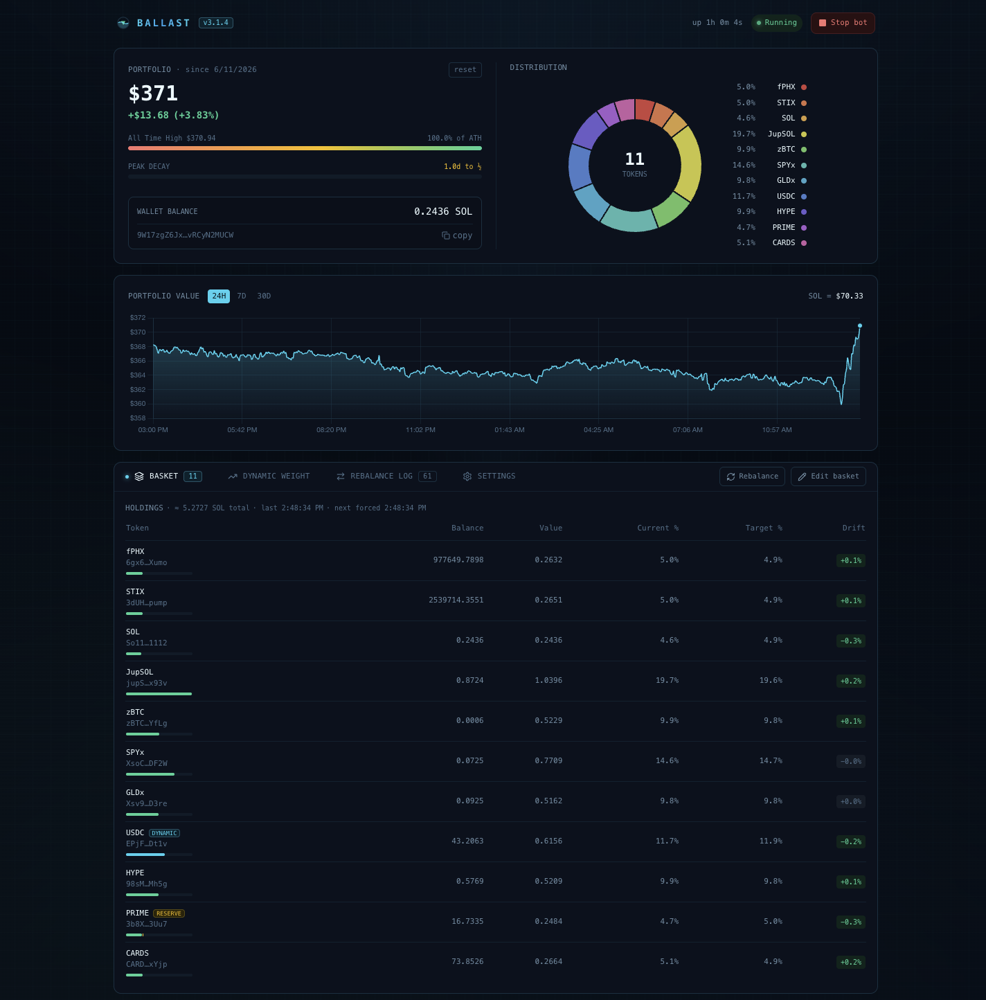

# solana-basket-manager

Self-hosted Solana token basket manager. Holds any SPL/Token-2022 tokens at target weights and automatically rebalances the portfolio on drift or schedule via Jupiter swaps. Includes a React dashboard for monitoring and control.

   



## Features

- **Token basket** — hold any SPL/Token-2022 tokens at target weights; auto-rebalances on drift or schedule via Jupiter swaps
- **Dynamic profit-taking** — the dynamic-weight token (default USDC) shifts target weight automatically based on basket PnL%, with an optional high-water-mark profit lock
- **Jupiter Lend yield** — optionally park the idle USDC sleeve into Jupiter Lend Earn for yield, keeping a liquid buffer and withdrawing on demand to fund rebalances (off by default)
- **PnL tracking** — SOL and USD baseline, 90-day portfolio chart
- **Live dashboard** — React + Tailwind "Cyber grid" UI with SSE updates: 50/50 hero (merged P&L + HWM bar + wallet tile ‖ distribution donut + legend), full-width portfolio chart, holdings table with per-token allocation bars and `DYNAMIC`/`RESERVE` pills, rebalance log, and a consolidated Settings tab (wallet, basket settings, Telegram, daily report)
- **Telegram** — start/stop + rebalance notifications and a scheduled daily report
- **Token-protected API** — all endpoints require an auth token (cookie or bearer); dashboard has a sign-in screen
- **Configurable at runtime** — basket weights, drift threshold, rebalance interval, lending — no restart needed

## Requirements

- Linux server (systemd) or Docker
- Node.js 22+ (installer handles this via nvm)
- [Helius](https://helius.dev) API key (RPC)

## Quick Start (systemd)

```bash
git clone https://github.com/fphxgallery/solana-basket-manager
cd solana-basket-manager
bash install.sh
```

The installer will:
1. Install Node.js 22 via nvm if not present
2. Prompt for API keys, generate a dashboard auth token, and create `.env`
3. Install dependencies and build server + client
4. Register and start `basket-manager.service` via systemd

Open the dashboard at `http://<server-ip>:3420` and sign in with the token the installer printed (the `API_TOKEN` value in `.env`).

## Quick Start (Docker)

```bash
cp .env.example .env   # fill in HELIUS_API_KEY + generate API_TOKEN
docker compose up -d
```

By default Docker binds to `127.0.0.1` only. Set `BIND_ADDR=0.0.0.0` in `.env` for LAN access.

## Configuration

### `.env`

```env
HELIUS_API_KEY=your_helius_key
API_TOKEN=...                      # required — openssl rand -hex 32
PORT=3420
#BIND_ADDR=0.0.0.0                 # Docker only — default 127.0.0.1
```

### Basket

Add tokens in the Basket tab. Each token needs:
- **Mint address** — any SPL or Token-2022 token
- **Target weight %** — must sum to 100 across all tokens

Rebalance settings (live, no restart):
- **Drift threshold %** — trigger rebalance when any token drifts this far from target
- **Rebalance interval (hours)** — force rebalance even without drift

## Architecture

```
src/
  index.ts        — Express server entry
  auth.ts         — API token auth (cookie / bearer)
  bot.ts          — timers, balance + basket refresh, rebalance orchestration
  basket.ts       — holdings refresh, pricing, rebalance execution, dynamic weight, lend accounting fold
  basket-store.ts — basket config + state persistence (data/basket.json)
  lending.ts      — Jupiter Lend Earn venue (deposit / withdraw / position / earnings)
  value-history.ts — portfolio value snapshots, 90-day (data/value-history.json)
  token-history.ts — per-token price + weight snapshots, 90-day (data/token-history.json)
  telegram.ts     — notifications + scheduled daily report
  api.ts          — REST + SSE endpoints
  config.ts       — env + app config
  wallet.ts       — keypair create/import/load (wallet/keypair.json)
client/src/
  App.tsx         — dashboard shell: state, SSE, data fetching, handlers, tab routing, modals
  lib.tsx         — shared helpers + primitives (Card, Modal, CopyButton, palette, formatters)
  types.ts        — shared API/state types
  index.css       — Cyber-grid theme tokens (CSS vars) + animated background
  components/      — CyberBackground, AppHeader, HeroCard, PortfolioChartCard,
                    Tabs, HoldingsTable, SettingsTab
```

**Rebalance flow:** 3-min timer prices holdings via Jupiter → every 5 min, if any token's drift exceeds the threshold (or the interval has elapsed) → sell overweight tokens, then buy underweight with the proceeds (Jupiter lite swaps, sent direct).

## Data Files

All runtime data lives in `data/` (excluded from git):

| File | Contents |
|---|---|
| `data/basket.json` | token list, weights, settings, price cache, PnL baseline, HWM, lend earnings baseline |
| `data/value-history.json` | portfolio value snapshots (90-day) |
| `data/token-history.json` | per-token price + weight snapshots (90-day) |
| `data/trades.json` | rebalance trade log (persists across restarts) |
| `data/lending-log.json` | Jupiter Lend deposit/withdraw activity (shown in the Logs tab) |
| `data/telegram.json` | Telegram bot token + chat ID + daily-report schedule |
| `wallet/keypair.json` | hot wallet keypair — **back this up** |

## Useful Commands

```bash
# Logs
journalctl -u basket-manager -f

# Restart
sudo systemctl restart basket-manager

# Status
sudo systemctl status basket-manager
```

## Security Notes

- Wallet keypair is a **hot wallet** — only fund it with what you're willing to put in the basket
- All API routes require `API_TOKEN` (HttpOnly cookie via dashboard sign-in, or `Authorization: Bearer` header)
- Docker binds `127.0.0.1` by default; prefer an SSH tunnel over `BIND_ADDR=0.0.0.0` when possible
- Traffic is plain HTTP — put a reverse proxy with TLS in front if exposing beyond localhost/LAN
- `.env` and `wallet/` are gitignored and never committed

## Changelog

Recent releases below. Full history in [CHANGELOG.md](CHANGELOG.md).

### v3.4.1
- **Logs tab polish** — the All / Rebalances / Lending filters moved up into the tab header (left of Clear logs), matching the other tabs' action layout; reclaims a row of vertical space

### v3.4.0
- **Logs tab** — the old "Rebalance Log" is now a unified **Logs** tab covering both rebalance swaps and Jupiter Lend deposits/withdrawals, with All / Rebalances / Lending filter pills. Lending events persist to `data/lending-log.json` and stay out of the trade metrics + value chart. New icon; clear honors the active filter

### v3.3.8
- **Price-impact gate** — skip rebalance swaps whose Jupiter quote price impact exceeds the new `maxPriceImpactPct` Basket setting (default 2%, `0` = off); gated swaps are logged and noted in the Telegram report but kept out of the trade log

### v3.3.7
- **Jupiter Lend read resilience** — retry-with-backoff (honoring `Retry-After`) on 429/5xx plus a 4-min per-endpoint cache with stale-on-error fallback, so the shared lite host's rate-limits and timeouts no longer surface as failed reads. Positions cache invalidated after deposit/withdraw

### v3.3.6
- **Fix:** removed a duplicate `🌱 Lent` line in the daily Telegram report (the second slot is the `🌱 Earned` line, shown once realized lend earnings clear $0)

### v3.3.5
- **Fix:** a transient Jupiter Lend `/positions` read failure no longer zeroes the lent balance and triggers a phantom liquidate-and-rebuy. The fold reuses the last good balance on failure; cold start skips rebalancing that cycle

## License

MIT
