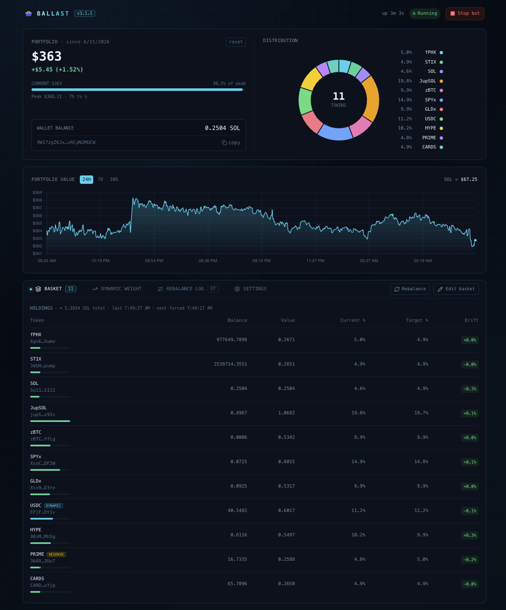

# solana-basket-manager

Self-hosted Solana token basket manager. Holds any SPL/Token-2022 tokens at target weights and automatically rebalances the portfolio on drift or schedule via Jupiter swaps. Includes a React dashboard for monitoring and control.

  



## Features

- **Token basket** — hold any SPL/Token-2022 tokens at target weights; auto-rebalances on drift or schedule via Jupiter swaps
- **Dynamic USDC profit-taking** — USDC target weight shifts automatically based on basket PnL%
- **PnL tracking** — SOL and USD baseline, 24h portfolio chart
- **Live dashboard** — React + Tailwind UI with SSE updates, rebalance log, wallet management
- **Token-protected API** — all endpoints require an auth token (cookie or bearer); dashboard has a sign-in screen
- **Configurable at runtime** — basket weights, drift threshold, rebalance interval — no restart needed

## Requirements

- Linux server (systemd) or Docker
- Node.js 22+ (installer handles this via nvm)
- [Helius](https://helius.dev) API key (RPC)

## Quick Start (systemd)

```bash
git clone https://github.com/fphxgallery/solana-basket-manager
cd solana-basket-manager
bash install.sh
```

The installer will:
1. Install Node.js 22 via nvm if not present
2. Prompt for API keys, generate a dashboard auth token, and create `.env`
3. Install dependencies and build server + client
4. Register and start `basket-manager.service` via systemd

Open the dashboard at `http://<server-ip>:3420` and sign in with the token the installer printed (the `API_TOKEN` value in `.env`).

## Quick Start (Docker)

```bash
cp .env.example .env   # fill in HELIUS_API_KEY + generate API_TOKEN
docker compose up -d
```

By default Docker binds to `127.0.0.1` only. Set `BIND_ADDR=0.0.0.0` in `.env` for LAN access.

## Configuration

### `.env`

```env
HELIUS_API_KEY=your_helius_key
API_TOKEN=...                      # required — openssl rand -hex 32
PORT=3420
#BIND_ADDR=0.0.0.0                 # Docker only — default 127.0.0.1
```

### Basket

Add tokens in the Basket tab. Each token needs:
- **Mint address** — any SPL or Token-2022 token
- **Target weight %** — must sum to 100 across all tokens

Rebalance settings (live, no restart):
- **Drift threshold %** — trigger rebalance when any token drifts this far from target
- **Rebalance interval (hours)** — force rebalance even without drift

## Architecture

```
src/
  index.ts        — Express server entry
  auth.ts         — API token auth (cookie / bearer)
  bot.ts          — timers, balance + basket refresh, rebalance orchestration
  basket.ts       — holdings refresh, pricing, rebalance execution, dynamic USDC weight
  basket-store.ts — basket config + state persistence (data/basket.json)
  value-history.ts — 24h portfolio value snapshots (data/value-history.json)
  api.ts          — REST + SSE endpoints
  config.ts       — env + app config
  wallet.ts       — keypair create/import/load (wallet/keypair.json)
client/src/
  App.tsx         — single-file React dashboard
```

**Rebalance flow:** 3-min timer prices holdings via Jupiter → every 5 min, if any token's drift exceeds the threshold (or the interval has elapsed) → sell overweight tokens, then buy underweight with the proceeds (Jupiter lite swaps, sent direct).

## Data Files

All runtime data lives in `data/` (excluded from git):

| File | Contents |
|---|---|
| `data/basket.json` | token list, weights, settings, price cache, PnL baseline |
| `data/value-history.json` | 24h portfolio value snapshots |
| `data/trades.json` | rebalance trade log (persists across restarts) |
| `wallet/keypair.json` | hot wallet keypair — **back this up** |

## Useful Commands

```bash
# Logs
journalctl -u basket-manager -f

# Restart
sudo systemctl restart basket-manager

# Status
sudo systemctl status basket-manager
```

## Security Notes

- Wallet keypair is a **hot wallet** — only fund it with what you're willing to put in the basket
- All API routes require `API_TOKEN` (HttpOnly cookie via dashboard sign-in, or `Authorization: Bearer` header)
- Docker binds `127.0.0.1` by default; prefer an SSH tunnel over `BIND_ADDR=0.0.0.0` when possible
- Traffic is plain HTTP — put a reverse proxy with TLS in front if exposing beyond localhost/LAN
- `.env` and `wallet/` are gitignored and never committed

## Changelog

### v2.2.5
- Feat: daily Telegram report redesigned using Bot API 10.1 `sendRichMessage` — headings, `<p>` block layout, and a `<table bordered striped>` for holdings; falls back to standard `sendMessage` on error
- Feat: P&L line now uses ▲/▼ arrow and 📈/📉 icon; portfolio, SOL price, peak, and wallet each on their own line

### v2.2.4
- Feat: P&L card now shows HWM peak value and time-to-half-life countdown in the upper-right corner (visible when HWM is enabled)
- Feat: daily Telegram report now includes a Peak line (`🏔 Peak: $X.XX (Xd to ½)`) after P&L when HWM is active

### v2.2.3
- Fix: bad Jupiter quotes (thin-liquidity pool spikes) can no longer corrupt portfolio value, the high-water mark, or the chart — quotes where the derived price deviates >10× from the cached price are rejected and the cache is used instead
- Fix: `resetBaseline` now also resets the HWM — a poisoned HWM from a bad quote could previously persist for days even after pressing the reset button
- Fix: outlier snapshots (>10× or <0.1× the previous point) are now rejected before being written to `data/value-history.json`

### v2.2.2
- Fix daily report not sending: `>=` comparison replaces strict equality so a 60s timer drift can't cause a missed minute; use local date instead of UTC so the date doesn't flip at midnight UTC in non-UTC timezones

### v2.2.1
- Fix: min-swap fee gate no longer skips every swap when the SOL/USD price is unavailable (CoinGecko outage) — the floor only applies when a price is known
- Fix: rebalance buys are now funded by sell proceeds — sells execute first, the SOL balance is re-fetched, then buys are sized against the updated budget (previously buys were clamped to the pre-sell balance and could be dropped entirely)
- Refactor: per-swap quote/sign/send/confirm logic extracted into `performSwap()`

### v2.2.0
- Basket settings fields (drift threshold, rebalance interval, min swap) now display on a single row

### v2.1.9
- Add min-swap fee gate to `executeRebalance` — swaps worth less than the configured USD floor are skipped to prevent fee bleed on small drift corrections
- New "Min swap ($)" setting in basket settings panel (default $5, configurable at runtime)

### v2.1.8
- Rebalance log now paginates at 12 entries per page with prev/next controls

### v2.1.7
- Replace bolt icon with basket icon in dashboard header
- Add SVG favicon (basket with Solana brand colors) — browser tab now shows basket logo
- Update page title to "Basket Manager"

### v2.1.6
- Portfolio value chart now supports 24H / 7D / 30D windows — toggle buttons in the chart header
- Value history extended from 24h to 30 days of storage (`data/value-history.json`)
- Time axis labels adapt per window: HH:MM (24H), Weekday HH:MM (7D), Mon DD (30D)

### v2.1.5
- Fix daily report P&L sign: negative P&L now correctly shows `-$X.XX` instead of `$X.XX`
- Move SOL price onto its own line in the daily report (was appended to the Portfolio line)

### v2.1.4
- Fix TypeScript build error: `saveTelegram` and `disconnectTelegram` now include `reportEnabled`/`reportTime` in state updates to match the extended telegram state type added in v2.1.3

### v2.1.3
- Add daily Telegram report — sends portfolio value (USD + SOL), P&L, and per-token current/target weights
- New **Daily Report** card in the dashboard (below Telegram settings) with enable toggle, time picker (server local time), and Send Report Now button
- Report schedule persisted in `data/telegram.json`; time checked every minute by the bot

### v2.1.2
- Fix swap confirmation: on timeout, poll `getSignatureStatus` once (5s delay) before marking failed — prevents false-failed rebalance swaps on slow confirmation
- Fix HWM disk writes: `updateHwm` only writes on a genuinely new peak, not on every 3-min refresh at steady-state
- Fix buy swaps: reserve 0.01 SOL for gas across all buy swaps in a rebalance pass; buys skip if budget exhausted
- Persist rebalance trade log to `data/trades.json` — log survives service restarts; totals recomputed from disk on startup

### v2.1.1
- Add **Dynamic Weight** tab — dedicated UI for the profit-taking curve and high-water mark settings
- Profit-taking curve is now fully configurable: editable [PnL%, USDC%] breakpoints, cap above max, add/delete rows, reset to defaults
- High-water mark controls moved from Basket Settings into the Dynamic Weight tab

### v2.1.0
- Add high-water mark profit lock for dynamic USDC weight — USDC target weight locks in at portfolio peaks and releases gradually via configurable exponential decay (default 7-day half-life)
- Configurable from dashboard: toggle + half-life input in Basket Settings panel
- HWM state (`hwmValueUsd`, `hwmCapturedAt`) persisted in `data/basket.json`, survives restarts
- Baseline reset does not affect HWM — profit lock persists through deposits (changed in v2.2.3: reset now also clears HWM)

### v2.0.3
- Add Telegram notifications — bot start/stop and rebalance summary (per-swap confirmed/failed)
- Configurable from the dashboard UI (TELEGRAM card); token stored in `data/telegram.json`, never exposed via API

### v2.0.2
- Fix phantom `pending` entries in rebalance log — dust-skipped swaps no longer added to trade history
- Deduplicate `getBalance` RPC call — wallet balance read from SOL balance already fetched by `refreshHoldings`
- Remove unused `ws` / `@types/ws` dependencies

### v2.0.1
- Fix `parseInt` precision on large Jupiter `outAmount` values (use `Number(BigInt(...))`)
- Remove unused installer prompts and dead dependencies
- Fix stale labels; rename `package.json` name to `solana-basket-manager`

## License

MIT
